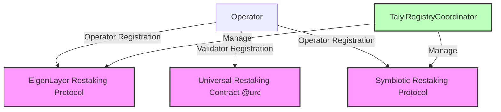
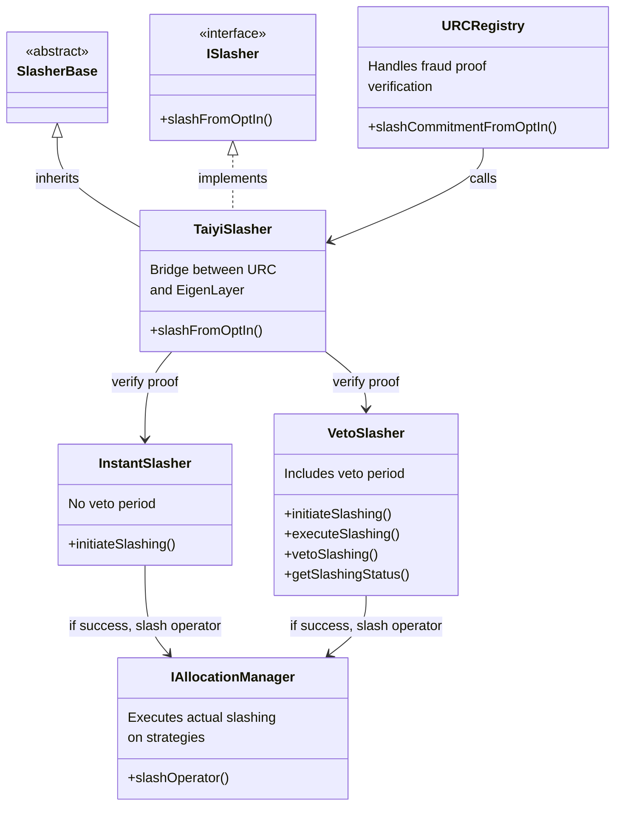
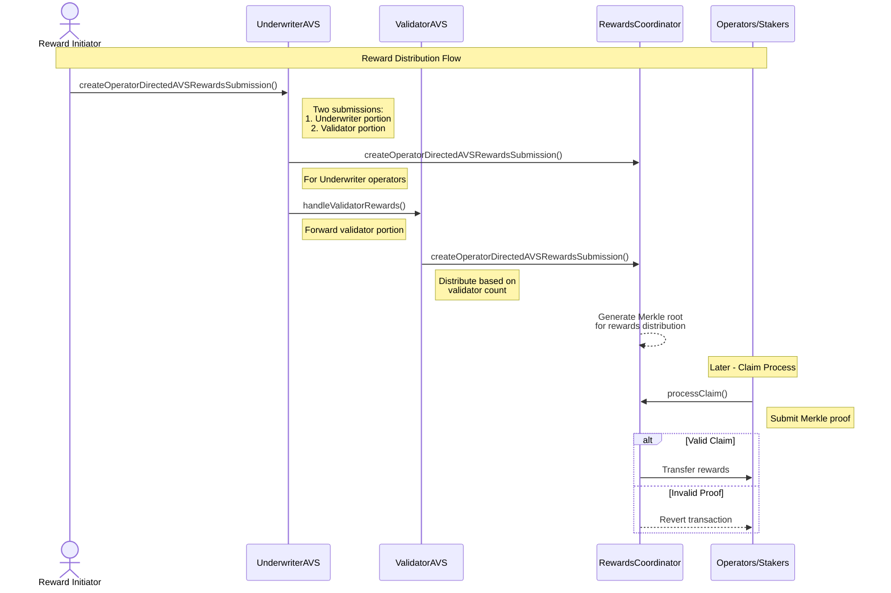

# LingLong 

> 🚧 **NOTICE** 🔨 This repository is under active development. Features may change, interfaces are not stable, and the codebase is evolving rapidly. 

## 1. Overview

LingLong is a flexible proposer commitment framework that enables Ethereum validators to trustlessly delegate commitment generation to specialized entities, without transferring operational control. Through its modular design, LingLong orchestrates commitment generation, data availability management, and auxiliary functions to create a streamlined process for variety of proposer commitment, such as preconfirmation, data availability, and more.

Key features of LingLong include:

- **Trustless Delegation**: Validators can delegate tasks like preconfirmations to specialized entities while maintaining their sovereignty and security guarantees.
- **Economic Security**: Leverages restaking protocols like Eigenlayer and Symbiotic to provide strong economic security while maintaining clear risk isolation between different layers of the system.
- **Modular Architecture**: Supports multiple [operator sets](https://docs.eigenlayer.xyz/developers/HowTo/build/slashing/design-operator-set) and [subnetworks](https://docs.symbiotic.fi/middleware-sdk/api-reference/extensions/Subnetworks/) within a single AVS/Network, forward compatible with multiple proposer commitment services.
- **Unified Marketplace**: Creates a unified marketplace for proposer commitment, eliminating the need for each base rollup to bootstrap its own validator network.

### 2. Actors
Two types of operators can participate in the Linglong:
   - **ETH Validator Operators**: Anyone who runs an ETH validator can participate as an operator to earn passive rewards from services he/she has delegated to.
   - **Service Provider Operators**: Anyone can participate as a service provider to earn rewards from providing proposer commitment services on behalf of ETH Validator Operators.

> **Note**: LingLong currently supports [Taiyi](https://github.com/lu-bann/taiyi) underwriting service, which is Luban's solution for Ethereum L1 preconfirmation. For more details, please refer to [Taiyi's documentation](https://docs.luban.wtf/taiyi_overview).

### 3. Contracts



#### Core Contracts
- **[EigenLayerMiddleware](./src/eigenlayer-avs/EigenLayerMiddleware.sol)**: Middleware contract for integrating with EigenLayer restaking infrastructure.
- **[SymbioticMiddleware](./src/symbiotic-avs/SymbioticMiddleware.sol)**: Middleware contract for integrating with Symbiotic restaking infrastructure.

#### Operator Registry Contracts
- **[PubkeyRegistry](./src/operator-registries/PubkeyRegistry.sol)**: Registry for storing and managing BLS public keys.
- **[SocketRegistry](./src/operator-registries/SocketRegistry.sol)**: Registry for managing socket connections.
- **[TaiyiRegistryCoordinator](./src/operator-registries/TaiyiRegistryCoordinator.sol)**: Coordinates the registration of operators in Linglong.

#### Taiyi Service Contracts
- **[TaiyiCore](./src/taiyi/TaiyiCore.sol)**: The core contract for Taiyi underwriting service that manages preconfirmation commitments.
- **[TaiyiEscrow](./src/taiyi/TaiyiEscrow.sol)**: Handles escrowed funds for Taiyi service providers.
- **[TaiyiParameterManager](./src/taiyi/TaiyiParameterManager.sol)**: Manages protocol parameters for the Taiyi service.
- **[TaiyiInteractiveChallenger](./src/taiyi/TaiyiInteractiveChallenger.sol)**: Implements interactive dispute resolution for Taiyi commitments.
- **[TaiyiNonInteractiveChallenger](./src/taiyi/TaiyiNonInteractiveChallenger.sol)**: Handles non-interactive challenges with cryptographic proofs.

#### Slashing


> **Note**: The slashing implementation is currently a WIP. The design concept follows the architecture illustrated in the diagram above, but specific implementation details are subject to change as development continues.

## 4. Registration 

### 4.1. EigenLayer

#### Register as an Operator in EigenLayer
Before interacting with the TaiyiRegistryCoordinator, an operator must first register with EigenLayer:

```solidity
DELEGATION_MANAGER.registerAsOperator(
    address(0), // No delegation approver, anyone can delegate(optional)
    0,          // No allocation delay(optional)
    "https://example.com/metadata" // Operator metadata URL
);
```

#### Stake Assets in EigenLayer
The operator must deposit assets into EigenLayer strategies to have active stake:
```solidity
WETH.approve(
    address(STRATEGY_MANAGER), amount
);

uint256 shares = STRATEGY_MANAGER.depositIntoStrategy(
    strategy_address, 
    token_address, 
    amount
);
```

#### Allocate Stake to Operator Set
After staking, the operator must allocate their stake to the specific operator set given an operator set id:

```solidity
// First set allocation delay to 0 (optional)
allocationManager.setAllocationDelay(operatorAddress, 0);

// Create allocation parameters
IAllocationManagerTypes.AllocateParams[] memory allocParams = new IAllocationManagerTypes.AllocateParams[](1);
allocParams[0] = IAllocationManagerTypes.AllocateParams({
    operatorSet: OperatorSet(taiyiMiddlewareAddress, operatorSetId),
    strategies: strategies,
    newMagnitudes: magnitudes  // Amount to allocate 
});

// Modify allocations
ALLOCATION_MANAGER.modifyAllocations(operatorAddress, allocParams);
```

#### Register for Operator Sets
Finally, the operator formally registers with the TaiyiRegistryCoordinator through the AllocationManager:

```solidity
// Format the registration data
string memory socket = "operator.example.com";
IPubkeyRegistry.PubkeyRegistrationParams memory pubkeyParams = /* Create pubkey params */;
bytes memory formattedData = abi.encode(socket, pubkeyParams);

// Create registration parameters
IAllocationManagerTypes.RegisterParams memory registerParams = IAllocationManagerTypes.RegisterParams({
    avs: taiyiMiddlewareAddress,
    operatorSetIds: [operatorSetId],
    data: formattedData
});

// Register for operator sets
ALLOCATION_MANAGER.registerForOperatorSets(operatorAddress, registerParams);

```

### 4.2. Symbiotic
> **Note**: Implementation details for Symbiotic integration are TBD. The implementation will follow a similar pattern to EigenLayer registration, but with Symbiotic-specific adjustments.


## 5. Reward Distribution


> **Note**: This illustrates how the Taiyi reward distribution works under EigenLayer integration.

> **Note**: Reward calculation is done on-chain by design to allow permissionless triggering of reward distribution, ensuring that any participant can initiate the distribution process without requiring special permissions.

Once operators or [validators](https://docs.eigenlayer.xyz/eigenlayer/operator-guides/operator-introduction#what-is-a-node-operator-within-eigenlayer) are registered in the AVSs, [reward distribution](https://docs.eigenlayer.xyz/eigenlayer/avs-guides/rewards) proceeds as follows:

1. The `rewardInitiator` calls function [`createOperatorDirectedAVSRewardsSubmission`](./src/eigenlayer-avs/UnderwriterAVS.sol) in `UnderwriterAVS`, providing two separate submissions (one labeled "underwriter," the other labeled "validator").  
2. The `UnderwriterAVS` contract first distributes the "underwriter" portion among its operators (based on an even split or a leftover mechanism), then calculates how much is actually reserved for `ValidatorAVS` (the "validator portion").  
3. `UnderwriterAVS` transfers that validator portion over to `ValidatorAVS`.  
4. ValidatorAVS then distributes its share among the registrar operators according to the pro rata validator count for each operator.

This flow is implemented under the hood by two key functions:

1) In `UnderwriterAVS`:  
   - [`_createOperatorDirectedAVSRewardsSubmission`](./src/eigenlayer-avs/UnderwriterAVS.sol#L67)  
   - [`_handleUnderwriterSubmission`](./src/eigenlayer-avs/UnderwriterAVS.sol#L110)  

In `_handleUnderwriterSubmission`, the UnderwriterAVS contract:  
• Receives a total token transfer.  
• Splits out the "underwriter portion" for UnderwriterAVS operators.  
• Returns the leftover "validator portion," which will be forwarded to ValidatorAVS.

2) In ValidatorAVS:  
   - [`handleValidatorRewards`](./src/eigenlayer-avs/ValidatorAVS.sol#L195)

The portion passed from UnderwriterAVS is then distributed among ValidatorAVS operators based on how many validators each operator controls:

##### Example Walk-Through

1. A `rewardInitiator` calls `UnderwriterAVS` with two submissions:  
   • The first ("underwriter") includes 1000 tokens to be shared among UnderwriterAVS operators.  
   • The second ("validator") is labeled "validator" but effectively starts out as a placeholder.

2. In `UnderwriterAVS`:  
   • `_createOperatorDirectedAVSRewardsSubmission` checks that there are exactly two submissions, and that they are labeled "underwriter" and "validator."  
   • It calls `_handleUnderwriterSubmission` on the "underwriter" portion. Suppose there are 5 underwriter operators. The function might designate 70% (700 tokens) to them and set aside 30% (300 tokens) for the validator portion.  
   • It returns 300 tokens (the "validator portion").

3. `UnderwriterAVS._createOperatorDirectedAVSRewardsSubmission()` then calls `ValidatorAVS.handleValidatorRewards`, passing in the second submission plus the 300-Token remainder. Suppose 3 validator operators collectively have a total of 100 validators. Operator1 has 50 validators, Operator2 has 30, Operator3 has 20, so they receive 150, 90, and 60 tokens, respectively.

4. Each AVS operator now can claim their share from the RewardsCoordinator, completing the reward distribution process in a single transaction flow.

