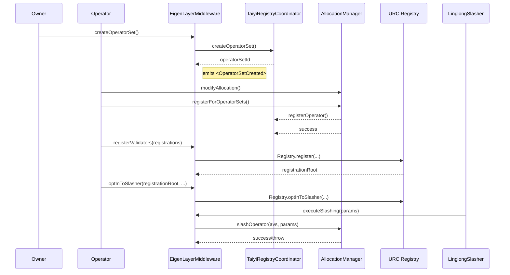

# EigenLayerMiddleware

| File | Notes |
| ---- | ----- |
| [`EigenLayerMiddleware.sol`](../src/eigenlayer-avs/EigenLayerMiddleware.sol) | Up-gradable middleware that bridges the **URC** validator ecosystem with EigenLayer restaking. |
| [`EigenLayerMiddlewareStorage.sol`](../src/storage/EigenLayerMiddlewareStorage.sol) | Unstructured storage layout used by the middleware upgrade proxy. |
| [`EigenLayerRewardsHandler.sol`](../src/eigenlayer-avs/EigenLayerRewardsHandler.sol) | Helper contract used to split and disburse AVS rewards. |

## Purpose
`EigenLayerMiddleware` sits between URC validators / challengers and the EigenLayer core contracts (`DelegationManager`, `AllocationManager`, …). It offers

* **Operator onboarding** – creates EigenLayer _operator sets_ (validator / underwriter) and registers operators in them via [`TaiyiRegistryCoordinator`](TaiyiRegistryCoordinator.md) **using the ID encoding from [`OperatorSubsetLib`](OperatorSubsetLib.md)**
* **Validator management** – forwards validator `register`, `unregister`, delegation & opt-in calls to the on-chain URC `Registry`
* **Slashing** – exposes `executeSlashing` that can be called **only** by `LinglongSlasher` once the challenger proof is verified
* **Rewards** – wraps `IRewardsCoordinator` and the local `EigenLayerRewardsHandler` to create operator-directed submissions

The contract is **UUPS-upgradeable** and owned by the AVS governance.

---

## High-level Flow

---

## Operator Registration

1. **Owner** (AVS governance) calls `createOperatorSet(strategies, type, minStake)`
   * Wrapper around `AllocationManager.createOperatorSet` through the coordinator.
   * Returns an `operatorSetId` ( `uint32` or `uint96` encoded).
2. **Operator** calls `AllocationManager.modifyAllocation` then `AllocationManager.registerForOperatorSets`
   * Callback from `AllocationManager` calls `TaiyiRegistryCoordinator.registerOperator`, which is required by interface `IAVSRegistrar`
3. `TaiyiRegistryCoordinator` validates the call ( `onlyRestakingMiddleware` ) and record the operator locally.

> The **socket** and **pubkey** of the operator can be updated later via the coordinator.

### Permissions
| Caller | Function | Condition |
| ------ | -------- | --------- |
| AVS Owner | `createOperatorSet` | `onlyOwner` |
| Operator  | `registerValidators`, `unregisterValidators`, `batchSetDelegations`, `optInToSlasher` | must belong to **validator operator set** (subset type `0`) |
| RegistryCoordinator | `deregister...` helper | must be set as **admin** in `PermissionController` (see test) |

---

## Validator Registration & Delegation

*Registration* and *delegation* data structures come from URC's [`Registry.sol`](../lib/urc/src/Registry.sol).

* `SignedRegistration` → BLS‐signed validator ID + owner
* `SignedDelegation` → BLS‐signed delegation authorising a committer key

The middleware stores delegations in an in-memory `DelegationStore` per `(operator, registrationRoot)` tuple.

### Fraud-Proof Window
Validators can be **slashed** only after the fraud-proof window has elapsed (`fraudProofWindow` in the Registry config). The middleware enforces this in `batchSetDelegations` & `optInToSlasher` via `SlashingLib.validateRegistrationConditions`.

---

## Opt-in to Slasher

`optInToSlasher` hands control to `LinglongSlasher`:

1. Operator calls middleware with registration root + delegations + delegatee data.
2. Middleware validates and stores delegations.
3. Middleware calls `Registry.optInToSlasher(root, SLASHER, delegatee)` – thereby whitelisting the slasher.

Once opted-in, `Registry` will forward any future `slashCommitment`/`slashRegistration` to `LinglongSlasher`.

---

## Slashing Path

`LinglongSlasher` is the single authorised caller of `executeSlashing`.

* Slasher verifies challenger proofs ( or interactive challenge )
* Builds `IAllocationManagerTypes.SlashingParams` ( strategies + amounts )
* Calls `EigenLayerMiddleware.executeSlashing`
* Middleware performs a `try/catch` into `AllocationManager.slashOperator` so it can return a boolean instead of reverting.

---

## Relevant Events
* `RewardsHandlerSet(address)` emitted when owner sets a new rewards handler.
* `OperatorIsNotYetRegisteredInValidatorOperatorSet()` – custom error from library used by many external functions.

---

## External References
* EigenLayer [docs](https://docs.eigenlayer.xyz/)
* URC – <https://github.com/eth-fabric/urc>

---
