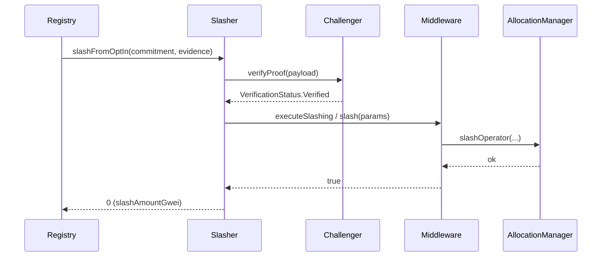

# LinglongSlasher

| File | Notes |
| ---- | ----- |
| [`LinglongSlasher.sol`](../src/slasher/LinglongSlasher.sol) | Dispatcher that bridges URC slashing callbacks to EigenLayer **or** Symbiotic slashing flows depending on operator stake. |

---

## Role in the System
The URC `Registry` emits `slashCommitment` / `slashRegistration` callbacks when a validator is proven faulty. Instead of interacting directly with restaking protocols, it forwards the call to **LinglongSlasher** (address provided during `optInToSlasher`).

The slasher is responsible for:

1. **Mapping** the faulting operator to the correct middleware (EigenLayer or Symbiotic) via `TaiyiRegistryCoordinator`.
2. **Verifying** challenger proofs by delegating to registered `ILinglongChallenger` contracts.
3. **Constructing** protocol-specific slashing parameters and calling the target middleware.
4. Preventing **double slashing** and tracking slashing progress for interactive challenges.

---

## Key Concepts

### Challenger Registry
*Owner* can `registerChallenger(challenger)` where the challenger implements `ILinglongChallenger` (see interface). Each challenger advertises the **violation type** it can prove.

```
Challenger
 ├─ name() → string
 ├─ getSupportedViolationType() → bytes32
 └─ verifyProof(bytes) → VerificationStatus
```

Violation type ⇄ challenger mapping is stored in `violationTypeChallengers` so the slasher can look it up when a commitment comes in.

Challenger contracts are stateless verification modules that only validate proof correctness without executing slashes themselves. In contrast, `LinglongSlasher` orchestrates the entire slashing workflow, coordinating between restaking protocols and executing the actual slash operations after receiving successful verification results from the appropriate challenger.

### Instant vs Interactive Slashing
There are two types of challenger:

* **Instant** – instant slashing, proof is self-contained, slasher immediately calls middleware upon a successful proof verification from the challenger contract.
* **Interactive** – proof is not self-contained, slasher opens a challenge and emits events for observers. Separate transactions will later resolve the challenge and execute slashing.

### Commitment Routing
On a `slashFromOptIn` call:

1. Extract `operator` from commitment payload (decode wrapper struct).
2. Ask `TaiyiRegistryCoordinator.getMiddlewareProtocol(middleware)` to decide protocol.
3. If **EIGENLAYER**:
   * Build `IAllocationManagerTypes.SlashingParams` (strategies, amounts, description)
   * Call `EigenLayerMiddleware.executeSlashing(params)`
4. If **SYMBIOTIC**:
   * Build `ISymbioticNetworkMiddleware.SlashParams`
   * Call `SymbioticNetworkMiddleware.slash(params)`

---

## Important Storage
| Slot | Purpose |
| ---- | ------- |
| `ALLOCATION_MANAGER` | EigenLayer `AllocationManager` address – needed to fetch strategies & operator sets. |
| `EIGENLAYER_MIDDLEWARE / SYMBIOTIC_MIDDLEWARE` | Middleware singletons. |
| `TAIYI_REGISTRY_COORDINATOR` | For look-ups. |
| `slashedCommitments` | mapping(bytes32 ⇒ bool) to prevent double slashing. |

---

## API Summary

| Function | Access | Description |
| -------- | ------ | ----------- |
| `slashFromOptIn(commitment, evidence, challenger)` | URC Registry | Main entrypoint; routes to protocol slashing. Returns 0 (all collateral/accounting done by middleware). |
| `registerChallenger(address)` / *deactivate/reactivate* | owner | Manage challenger registry. |
| `setEigenLayerMiddleware` / `setSymbioticMiddleware` | owner | Update middleware singletons. |

---

## Sequence Diagram



---

## References
* URC Registry source – [`Registry.sol`](../lib/urc/src/Registry.sol)  
* EigenLayer slashing interface – [`IAllocationManager.slashOperator`](https://github.com/Layr-Labs/eigenlayer-middleware-contracts/blob/main/src/contracts/core/AllocationManager.sol) 