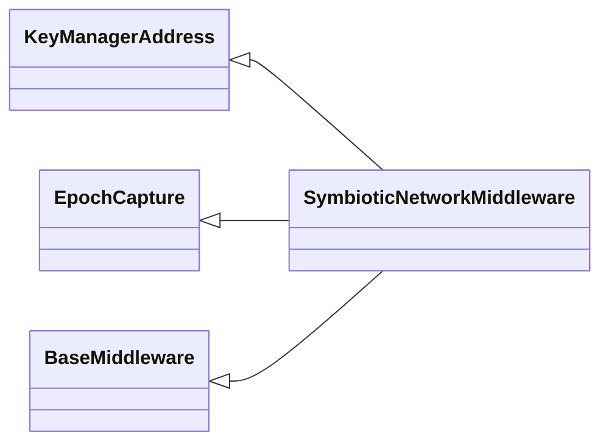
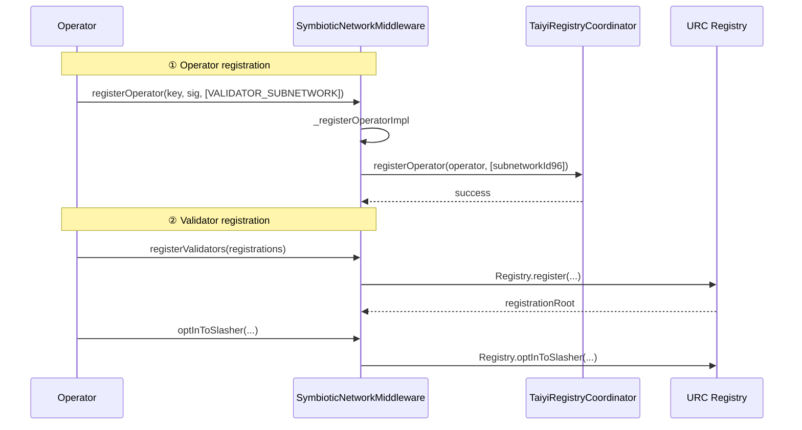

# SymbioticNetworkMiddleware

| File | Notes |
| ---- | ----- |
| [`SymbioticNetworkMiddleware.sol`](../src/symbiotic-network/SymbioticNetworkMiddleware.sol) | Middleware that manages Symbiotic **subnetworks** and forwards slashing / rewards to the Symbiotic core. |


## Overview
Unlike EigenLayer (which relies on `AllocationManager`), the Symbiotic protocol allocates stake through **vaults** and **subnetworks**. `SymbioticNetworkMiddleware` provides:

* Creation of new subnetworks (`createNewSubnetwork`) – IDs generated with [`OperatorSubsetLib`](OperatorSubsetLib.md)
* Operator self-registration (`registerOperator`) – mapping base subnetworks to encoded `uint96` ids
* Validator onboarding & delegation similar to EigenLayer
* Opt-in to URC slasher & forwarding of slashing calls
* Reward distribution hooks that plug into Symbiotic vault power accounting

It inherits from several mix-ins of the Symbiotic [middleware SDK](https://github.com/symbioticfi/middleware-sdk) ( `BaseMiddleware`, `EpochCapture`, `KeyManagerAddress`) and is upgrade-able via UUPS.

### Inheritance Map



---

## Registration Flow



The `uint96` subnetwork id is built by `encodeOperatorSetId96(protocol, baseId)` helper where the higher 32 bits store the protocol enum.

---

## Slashing Path
`LinglongSlasher` detects that the operator holds Symbiotic stake and calls:

```solidity
middleware.slash(
  SlashParams({
    timestamp: block.timestamp,
    key: key,
    amount: amount,
    subnetwork: subnetwork,
    slashHints: slashHints
  })
)
```

The contract calculates vault power and burns stake via `VaultManager._slashVault` inherited from the SDK.

---

## Important Public Methods

| Method | Who | Description |
| ------ | --- | ----------- |
| `createNewSubnetwork(baseId, minStake)` | owner | Declares a new subnetwork and mirrors it inside the coordinator. |
| `registerOperator(key, sig, baseSubnetworks)` | operator | Self-registration + key binding. |
| `registerValidators` / `unregisterValidators` | validator operators | Mirror URC Registry. |
| `batchSetDelegations` | validator operators | After fraud-proof window. |
| `optInToSlasher` | validator operators | Authorise Slasher. |
| `slash(SlashParams)` | Slasher | Slashes stake across vaults. |

---

## SlashParams Structure
```solidity
struct SlashParams {
  uint48 timestamp;    // capture epoch
  bytes key;           // operator key
  uint256 amount;      // WAD amount to slash per vault
  bytes32 subnetwork;  // encoded uint96
  bytes[] slashHints;  // optimisation hints
}
```

---

## Links
* Symbiotic protocol – <https://symbiotic.network/>  
* Middleware SDK – <https://github.com/symbiotic-network/middleware-sdk> 