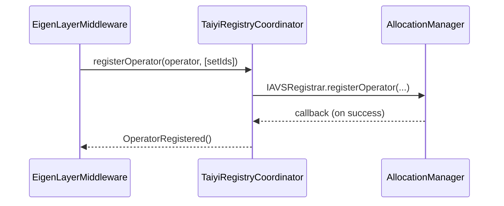
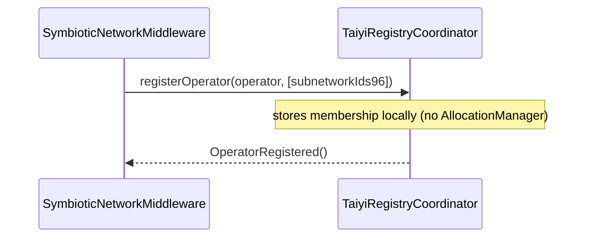

# TaiyiRegistryCoordinator

| File | Notes |
| ---- | ----- |
| [`TaiyiRegistryCoordinator.sol`](../src/operator-registries/TaiyiRegistryCoordinator.sol) | Canonical registry that maps **operators** to either EigenLayer _operator sets_ or Symbiotic _sub-networks_. |
| [`TaiyiRegistryCoordinatorStorage.sol`](../src/storage/TaiyiRegistryCoordinatorStorage.sol) | Explicit storage slots used by the coordinator. |

---

## Motivation
The coordinator unifies the bookkeeping for multiple **restaking protocols** under a single contract so that:

* Middleware contracts ( EigenLayer & Symbiotic ) can register / deregister operators through the **same** interface.
* Off-chain indexers & challengers have one source of truth for operator ➜ service-type mappings.

The contract implements three public interfaces:

1. `ITaiyiRegistryCoordinator` – rich view & helper methods
2. `IAVSRegistrar` – minimal EigenLayer interface that `AllocationManager` expects
3. `OwnableUpgradeable`, `Pausable`, `EIP712Upgradeable` – access-control & meta-tx support

---

## Data Model

| Concept | EigenLayer | Symbiotic |
| ------- | ---------- | --------- |
| **Service Type** | *Operator Set* (`uint32`) | *Sub-network* (`uint96` encoded) |
| Identifier storage | `_operatorSets.uint32Sets` | `_operatorSets.uint96Sets` |
| Operator→set mapping | `_operatorSetMembers32[setId]` | `_operatorSetMembers96[setId]` |

Each operator keeps a compact `OperatorInfo` struct:

```solidity
struct OperatorInfo {
    uint96 operatorId;      // incremental id
    OperatorStatus status;  // REGISTERED / DEREGISTERED / ...
    bytes socket;           // user supplied metadata
}
```

Restaking protocol of a middleware is tracked in `restakingProtocolMap : address → enum {NONE,EIGENLAYER,SYMBIOTIC}` **and the ID itself encodes the protocol via [`OperatorSubsetLib`](OperatorSubsetLib.md)**.

---

## External Write API

| Function | Who | Description |
| -------- | --- | ----------- |
| `registerOperator(operator, setIds, data)` | middleware | Route to `_registerOperatorForEigenlayer` **or** `_registerOperatorForSymbiotic` based on `msg.sender` protocol. Validates min-stake via `AllocationManager` or local mapping. |
| `deregisterOperator(operator, setIds)` | middleware | Mirrors registration path; emits `<OperatorDeregistered>` events. |
| `createOperatorSet(id, minStake)` | EigenLayer middleware (owner) | Declare a new operator set (32-bit id). |
| `createSubnetwork(id96, minStake)` | Symbiotic middleware | Declare a sub-network (`uint96` = protocol flags << 32 | baseId). |
| `updateSocket(string)` | operator | Update off-chain metadata. |

Most mutating functions are gated by `Pausable` bit-flags (`PAUSED_REGISTER_OPERATOR`, `PAUSED_DEREGISTER_OPERATOR`, …).

---

## Flow Diagrams

### 1️⃣ EigenLayer Path



### 2️⃣ Symbiotic Path



---

## Integration With Slashing
The coordinator is **read-only** during slashing. `LinglongSlasher` queries:

* `getOperatorAllocatedOperatorSets` to discover in which sets / subnetworks the operator holds stake.
* `getMiddlewareProtocol` to decide the slashing handler.

---


## External Links
* EigenLayer **AVS registrar interface** – <https://github.com/Layr-Labs/eigenlayer-middleware-contracts/blob/main/src/contracts/interfaces/IAVSRegistrar.sol> 