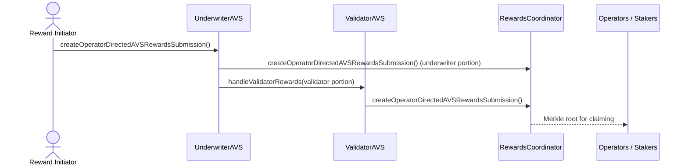

# Reward Distribution Flow

This note explains how **UnderwriterAVS** and **ValidatorAVS** cooperate to produce operator-directed rewards using EigenLayer's `RewardsCoordinator`.

See the sequence diagram below and the implementation pointers.

## Implementation Pointers
* Underwriter: [`UnderwriterAVS.sol`](../src/eigenlayer-avs/UnderwriterAVS.sol)  →
  * `_createOperatorDirectedAVSRewardsSubmission`
  * `_handleUnderwriterSubmission`
* Validator: [`ValidatorAVS.sol`](../src/eigenlayer-avs/ValidatorAVS.sol)  →
  * `handleValidatorRewards`

### Example Split
1. Underwriter receives `1000` tokens. Suppose it allocates `700` to its own operators and forwards `300` to ValidatorAVS.
2. ValidatorAVS splits the `300` among validator operators pro-rata by validator count.

Reward calculation happens **on-chain** so anyone can trigger distribution without special permissions. 