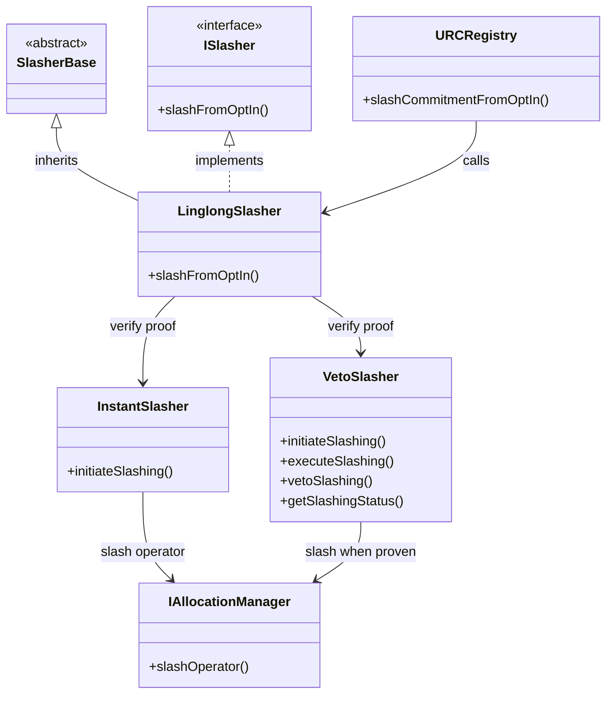

# Slashing Design (WIP)

This document captures the **high-level design** for slashing within the LingLong stack.  
Implementation is still in flux – expect breaking changes.

---

## Flow Summary
1. **URC Registry** finds a fraudulent commitment ➜ calls `LinglongSlasher.slashFromOptIn`.
2. Slasher verifies the proof via a registered **ILinglongChallenger** implementation.
3. Depending on the protocol (EigenLayer or Symbiotic) it forwards to the corresponding middleware:
   * `EigenLayerMiddleware.executeSlashing(params)`
   * `SymbioticNetworkMiddleware.slash(params)`
4. Executors call `AllocationManager.slashOperator` (EigenLayer) or vault manager (Symbiotic) to burn stake.

## Instant vs Veto Slashing
* **InstantSlasher** – fully on-chain proof, executed immediately.
* **VetoSlasher** – opens a time-boxed veto window before finalising slashing.

For contract-level details see [`LinglongSlasher.md`](LinglongSlasher.md). 