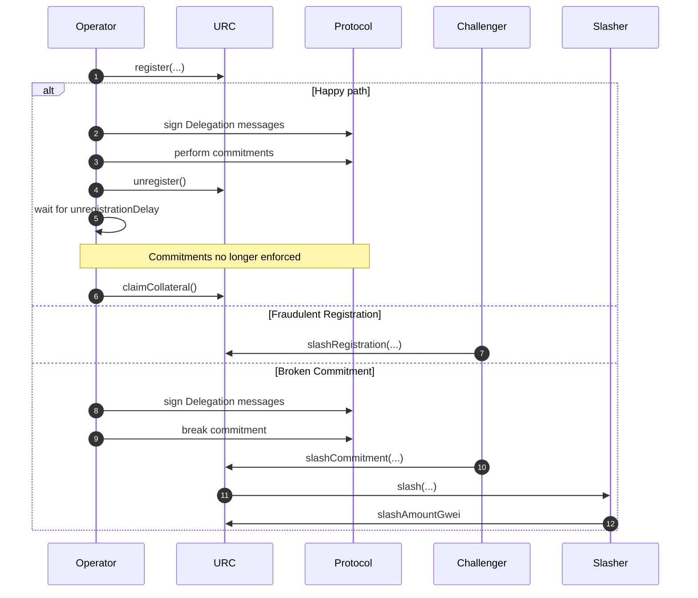
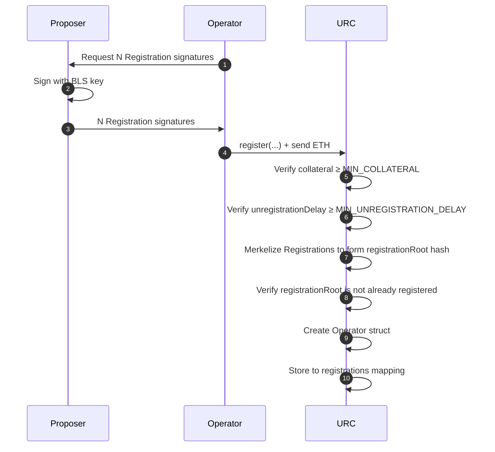
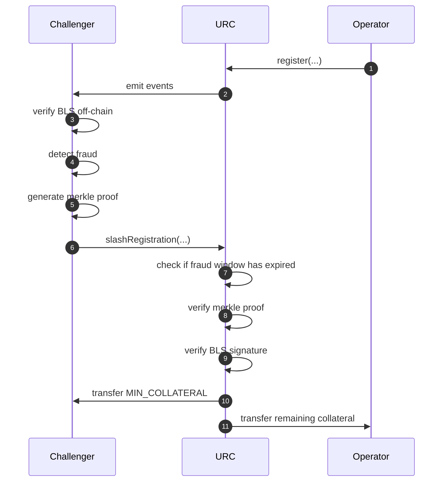
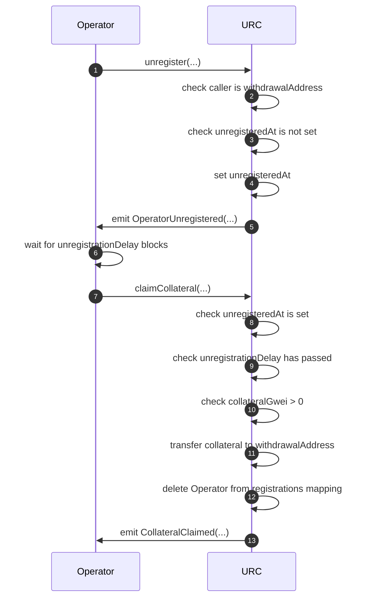
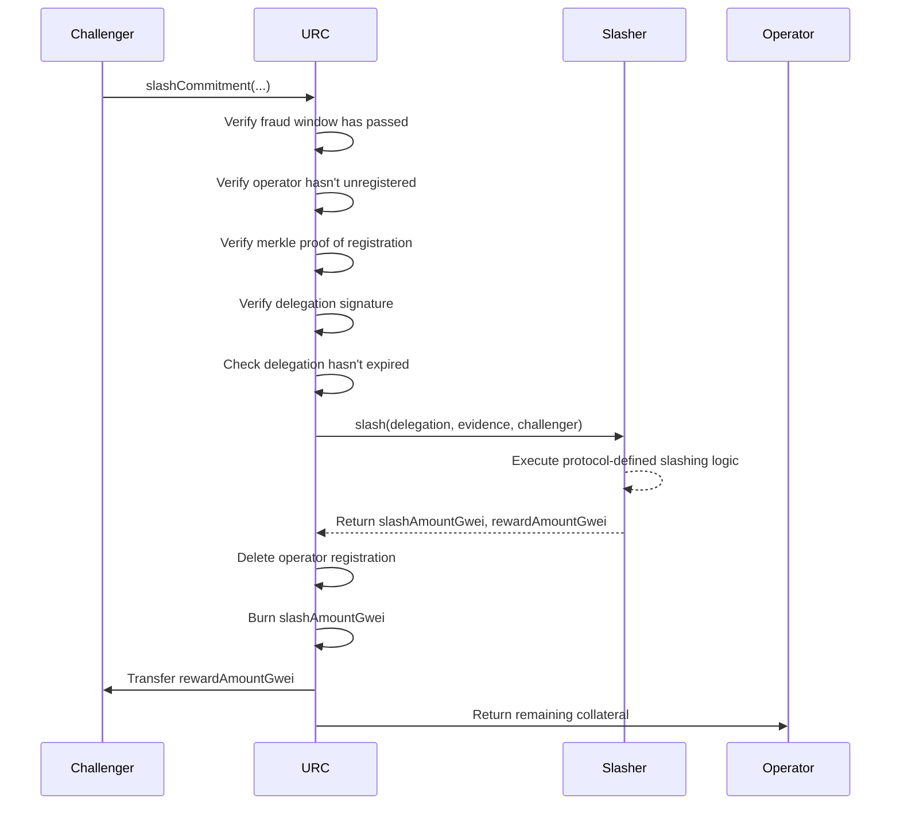

# URC Overview

## Milestones
- [X] Batch register an operator (cheaply)
- [X] Unregister/Claim collateral
- [X] Slash with bytecode
- [X] Slash with arbitrary `Slasher` contracts
- [ ] Social consensus on design
- [ ] ERC
- [ ] Audit


## Overview


## Schemas
The message signed by an operator's BLS key and supplied to the URC's `register()` function.
```Solidity
struct RegistrationMessage {
    /// The address used to deregister operator and claim collateral
    address withdrawalAddress; 

    /// The number of blocks that must elapse between deregistering and claiming
    uint16 unregistrationDelay; 
}
```

Registration signatures are created as follows:
```Solidity
    bytes memory message = abi.encodePacked(withdrawalAddress, unregistrationDelay);
    
    BLS.G2Point memory signature = BLS.sign(message, secretKey, registry.DOMAIN_SEPARATOR());
```
---

`Delegation` messages are off-chain messages defined in the [Constraints API](https://github.com/ethereum-commitments/constraints-specs). The message is signed by a proposer's BLS key to delegate to another party. 
```Solidity
struct Delegation {
    /// The proposer's BLS public key
    BLS.G1Point proposerPubKey;
    /// The delegate's BLS public key
    BLS.G1Point delegatePubKey;
    /// The address of the slasher contract
    address slasher;
    /// The slot number after which the delegation expires
    uint64 validUntil;
    /// Arbitrary metadata reserved for use by the Slasher
    bytes metadata;
}
```

`SignedDelegation` signatures are used to slash a proposer if they break their commitment and are expected to be signed as follows:

```solidity
struct SignedDelegation {
    /// The delegation message
    Delegation delegation;
    /// The signature of the delegation message
    BLS.G2Point signature;
}

bytes memory message = abi.encode(delegation);

bytes memory domainSeparator = ISlasher(delegation.slasher).DOMAIN_SEPARATOR();

BLS.G2Point memory signature = BLS.sign(message, secretKey, domainSeparator);
```

## Optimistic Registration Process
We define an `operator` to be an entity who registers one or more BLS keys.
The URC allows operators to optimistically register BLS keys for proposer commitment protocols, while maintaining security through a fraud-proof window.

### Off-Chain Preparation
For each key to register, the operator signs a `RegistrationMessage`, which binds them to a `withdrawalAddress` used to unregister and claim collateral, and an `unregistrationDelay` used to enforce a delay before the operator can deregister. The URC does not require the `withdrawalAddress` to interact with the proposer commitment supply chain, and it can be in cold storage or a multisig.

### register()
```solidity
 function register(
    Registration[] calldata regs, address withdrawalAddress, uint16 unregistrationDelay)
        external
        payable
        returns (bytes32 registrationRoot);
```

```solidity
/// Mapping from registration merkle roots to Operator structs
mapping(bytes32 operatorCommitment => Operator) public registrations;
```

The operator supplies at least `MIN_COLLATERAL` Ether to the contract and batch registers `N` BLS keys. To save gas, the contract will not verify the signatures of the `Registration` messages, nor will it save the BLS keys directly. Instead, the register function will merkleize the inputs to a root hash called the `registrationRoot` and save this to the `registrations` mapping. An `Operator` is constructed to save the minimal data for the operator's lifecycle, optimized to reduce storage costs.

```solidity
    /// An operator of BLS key[s]
    struct Operator {
        /// The address used to deregister from the registry and claim collateral
        address withdrawalAddress;
        /// ETH collateral in GWEI
        uint56 collateralGwei;
        /// The block number when registration occurred
        uint32 registeredAt;
        /// The block number when deregistration occurred
        uint32 unregisteredAt;
        /// The number of blocks that must elapse between deregistering and claiming
        uint16 unregistrationDelay;
    }
```



### slashRegistration()
After registration, a fraud proof window opens during which anyone can challenge invalid registrations. Fraud occurs if a validator BLS signature did not sign over the supplied `RegistrationMessages`. To prove fraud, the challenger first provides a merkle proof to show the `signature` is part of a merkle tree with the `registrationRoot` root hash. Then the `signature` is verified using the on-chain BLS precompiles. 

If the fraud window expires without a successful challenge, the operator's BLS keys are considered registered and they can participate in proposer commitment protocols.

```solidity
function slashRegistration(
    bytes32 registrationRoot,
    Registration calldata reg,
    bytes32[] calldata proof,
    uint256 leafIndex
) external returns (uint256 slashedCollateralWei);
```



## Deregistration Process
Exiting the URC is a two-step process. First, the operator must call `unregister()`, which marks the `unregisteredAt` timestamp in the `Operator` struct. After the operator's `unregistrationDelay` has passed, they can call `claimCollateral()`, which will transfer the operator's collateral to their registered `withdrawalAddress`.



## Slashing Process
The URC supports two types of slashing:

1. Registration Fraud - When an operator submits invalid BLS signatures during registration [described above](#slashregistration)
2. Commitment Breaking - When an operator breaks a commitment defined by a Slasher contract

### Commitment Breaking Process
Operators are expected to sign `Delegation` messages with their registered BLS keys, which commit them to a protocol-defined `Slasher` contract. If the operator breaks their commitment, a challenger can supply evidence and call `slashCommitment()` on the URC. This will call the `Slasher` contract's `slash()` function, which informs the URC of the amount of collateral to be slashed and the amount to reward the challenger.



The slashing process follows these steps:

1. A challenger calls `slashCommitment()` with:
   - `registrationRoot`: The merkle root of the operator's registration
   - `registrationSignature`: The BLS signature from registration
   - `proof`: Merkle proof showing the key is registered
   - `signedDelegation`: The delegation message signed by the operator
   - `evidence`: Proof that the operator broke their commitment

2. The URC performs several validations:
   - Verifies the fraud proof window has passed
   - Checks the operator hasn't already unregistered and their unregistration delay elapsed
   - Verifies the merkle proof to confirm key registration
   - Verifies the delegation signature using the operator's BLS key
   - Checks the delegation hasn't expired

3. If validations pass, the URC:
   - Calls the Slasher contract's `slash()` function with the delegation and evidence
   - Receives back the amount to slash (`slashAmountGwei`) and the amount to reward the challenger (`rewardAmountGwei`)
   - Deletes the operator's registration
   - Burns `slashAmountGwei`
   - Transfers `rewardAmountGwei` to the challenger
   - Returns any remaining collateral to the operator's withdrawal address

The process will revert if:
- The operator is not registered
- The fraud proof window hasn't passed
- The operator has already unregistered
- The merkle proof is invalid
- The delegation signature is invalid
- The delegation has expired
- The slash amount is 0 or exceeds the operator's collateral
